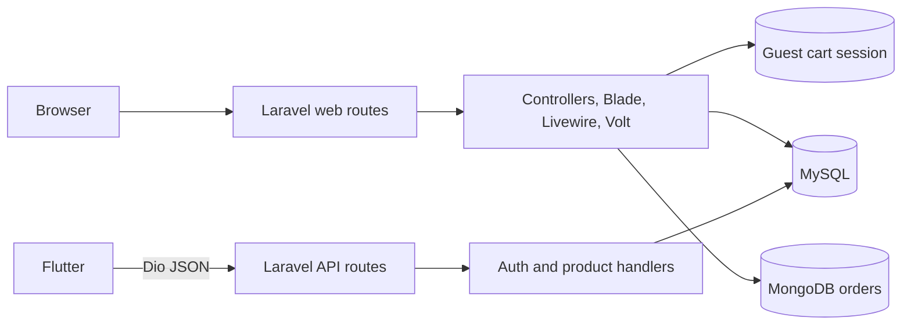

<div align="center">


# ByteCart

**An academic electronics storefront with a Laravel web application and a Flutter companion client**


[Overview](#overview) | [Implemented features](#implemented-features) | [Architecture](#architecture) | [Technology stack](#technology-stack) | [Installation and setup](#installation-and-setup)

</div>

---

## Overview

ByteCart is an academic electronics storefront composed of two applications:

- **`bytecart_website/`** is the main implementation: a Laravel storefront, customer account area, administration UI, JSON API, relational catalog/cart storage, and MongoDB order storage.
- **`bytecart_app/`** is a Flutter Android/iOS client with responsive commerce screens. Registration, login, and read-only product retrieval match the Laravel API; most other mobile workflows are not connected to server routes.

The web application implements the complete purchase path. The mobile application is best treated as a companion prototype, not a feature-equivalent client. This repository contains no AI, ML, or recommendation subsystem.

## Implemented features

### Laravel web application

- Browse, filter, and sort the catalog; use multi-term live search; view variants, stock, specifications, discounts, and related products.
- Keep guest carts in the session and authenticated carts in `user_carts`; validate stock and distinguish variant options per line. Checkout adds **$5.00 shipping** and **5% tax**.
- Store order snapshots in MongoDB while relational storage holds catalog, accounts, wish lists, carts, and inventory; customers manage their profile, addresses, payment preferences, wish list, and orders on the web.
- Provide management screens for products, variants, inventory, users, orders, and dashboard metrics, backed by Fortify, Jetstream, and Sanctum authentication features.

### Flutter client

- Responsive home, shop, search, product, cart, checkout, order, wish-list, and account screens.
- Riverpod state, Dio networking, product-read retries, and persisted light, dark, or system themes.
- Working mobile registration/login and product list/detail retrieval against the declared Laravel API.
- Client-side search, recent searches, product-card polling, and location/reverse-geocoding helpers.

> [!IMPORTANT]
> A mobile screen or service method does not imply an end-to-end feature. Only authentication and read-only catalog requests currently have matching Laravel API routes.

## Architecture



| Store              | Responsibility                                                                             |
| ------------------ | ------------------------------------------------------------------------------------------ |
| MySQL              | Users, sessions, tokens, products, variants, carts, wish lists, inventory, cache, and jobs |
| Session            | Guest cart before authentication                                                           |
| MongoDB            | Active `orders` and `order_items` documents                                                |
| Mobile preferences | Bearer token, cached identity, theme, and recent searches                                  |

### Web checkout flow

1. Require an authenticated customer and a non-empty cart.
2. Validate contact, address, payment method, and optional card fields.
3. Save current account, address, and payment preferences in MySQL.
4. Insert a pending order document in MongoDB.
5. Lock each MySQL product variant, recheck stock, decrement inventory, and commit.
6. Insert MongoDB order-item snapshots, then unlock and clear the cart.

These MySQL and MongoDB writes are coordinated in application code, not one distributed transaction.

## Technology stack

| Layer           | Technology                                                      |
| --------------- | --------------------------------------------------------------- |
| Backend         | PHP `^8.2`, Laravel 12, Eloquent, Sanctum, Fortify, Jetstream   |
| Web UI          | Blade, Livewire 3, Volt, Flux, Livewire PowerGrid, Tailwind CSS |
| Web tooling     | Vite 7, PostCSS, npm                                            |
| Data            | MySQL for relational data; `mongodb/laravel-mongodb` for orders |
| Mobile          | Flutter `>=3.29.0`, Dart `>=3.7.2 <4.0.0`, Riverpod 3, Dio 5    |
| Device services | Geolocator, Geocoding, Shared Preferences                       |
| Quality         | Pest/PHPUnit, Laravel Pint, Flutter Test, Flutter Lints         |

## Project structure

```text
.
├── bytecart_website/
│   ├── app/                    Controllers, models, providers, cart service
│   ├── database/               Migrations and minimal user seeder
│   ├── resources/views/        Blade, Livewire, and Volt views
│   ├── routes/ and tests/      Route definitions and Pest/PHPUnit tests
│   └── composer.json/package.json
├── bytecart_app/
│   ├── android/ and ios/       Platform projects
│   ├── assets/                 Logo, splash, and payment images
│   ├── lib/                    Models, pages, API, themes, and widgets
│   ├── test/                   Flutter widget test
│   └── pubspec.yaml
└── README.md
```

## Installation and setup

### Prerequisites

- PHP 8.2+, Composer 2, and the PHP MongoDB extension
- Node.js and npm compatible with the locked Vite 7 toolchain
- MySQL and a reachable MongoDB instance
- Flutter 3.29+ with Dart 3.7.2+; no Docker or deployment configuration is included

### Web application

From the repository root in PowerShell:

```powershell
Set-Location bytecart_website
composer install
npm ci
Copy-Item .env.example .env
php artisan key:generate
```

The tracked `.env.example` selects SQLite and omits MongoDB settings. The implemented order and cancellation paths explicitly use MySQL, so configure `.env` with your own credentials:

```env
APP_NAME=ByteCart
APP_URL=http://127.0.0.1:8000
DB_CONNECTION=mysql
DB_HOST=127.0.0.1
DB_PORT=3306
DB_DATABASE=bytecart
DB_USERNAME=your_database_user
DB_PASSWORD=your_database_password
MONGODB_ORDERS_HOST=127.0.0.1
MONGODB_ORDERS_PORT=27017
MONGODB_ORDERS_DATABASE=bytecart_orders
MONGODB_ORDERS_USERNAME=
MONGODB_ORDERS_PASSWORD=
MONGODB_ORDERS_AUTH_DATABASE=admin
MONGODB_ORDERS_SSL=false
```

`MONGODB_ORDERS_DSN` may be used instead of host/port fields. Never commit `.env` or real credentials.

Create the MySQL database, start MySQL and MongoDB, then run:

```powershell
php artisan migrate
composer run dev
```

`composer run dev` starts the Laravel development server, database queue listener, and Vite. Laravel serves on `http://127.0.0.1:8000` by default. The seeder creates only `test@example.com`; it does not create an administrator or populate products.

### Flutter client

Keep Laravel on port `8000`, then use another terminal:

```powershell
Set-Location bytecart_app
flutter pub get
flutter run
```

The API and image origins are hard-coded as `http://10.0.2.2:8000`, the Android emulator alias for the host. Physical devices and iOS simulators require source changes to the base URLs.

## Mobile API compatibility

| Method | Laravel endpoint             | Flutter use                                          |
| ------ | ---------------------------- | ---------------------------------------------------- |
| `POST` | `/api/register`              | Create account and cache a Sanctum token             |
| `POST` | `/api/login`                 | Authenticate and cache a Sanctum token               |
| `GET`  | `/api/products`              | Load catalog; mobile search runs locally             |
| `GET`  | `/api/products/{id}`         | Load product detail                                  |
| `GET`  | `/api/products/search?q=...` | Declared, but shadowed by the preceding `{id}` route |

No token-protected mobile API routes are declared for cart, checkout, profile, addresses, payment, orders, wish lists, or product filters.

## Testing

```powershell
# bytecart_website
composer test
npm run build

# bytecart_app
flutter analyze
flutter test
```

The PHP suite primarily covers starter authentication/settings behavior; project-specific catalog, checkout, order, admin, and mobile API flows lack automated coverage. The sole Flutter widget test is still the generated counter test and does not represent `MyApp`.

## Security and known limitations

- Several administration CRUD routes require authentication and verification but do not enforce the `admin` role in middleware, policies, or their controllers. The dashboard view performs an inline check; affected mutation endpoints remain exposed to verified users.
- There is no payment-gateway integration. Card number, cardholder, expiry, and CVV are stored with Laravel application encryption; real card data must not be used, and CVV storage is inappropriate for production.
- Cross-database checkout is not atomic. Inventory is committed before MongoDB line-item insertion, so a later failure can leave stock changed even when order documents are cleaned up.
- The Flutter checkout does not submit an order; its success path only calls the missing cart-clear API endpoint.
- Mobile bearer tokens use `shared_preferences`, networking uses plain HTTP, and the Android release manifest lacks `INTERNET`; release signing also uses debug keys.
- Product images are bundled, but there is no catalog import/seeder or initial-admin creation workflow.
- `/categories` references a missing Blade view, and the API search route is unreachable because of route order.
- The guest-cart login listener exists but its event provider is not registered in `bootstrap/providers.php`.
- Workflow files are nested under `bytecart_website/.github/workflows`, not the repository-root location GitHub Actions discovers.
- No repository licence, production packaging, container setup, or deployment configuration is present.

---

## Contact Information

**Developer**: Dillon Fernandez<br>
**Email**: dillonfernandez@gmail.com<br>
**Institution**: APIIT

---

<div align="center">
  <p><strong>Disclaimer</strong></p>
  <p><em>This is an academic project developed for educational purposes and is not intended for commercial use.</em></p>
</div>
