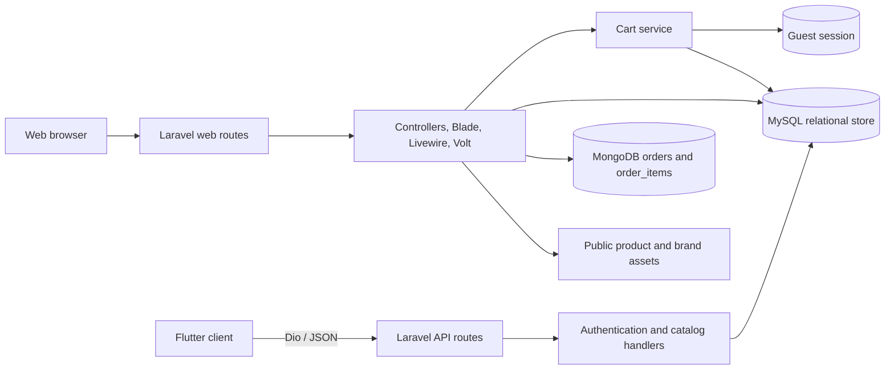

<div align="center">


# ByteCart

**An academic electronics storefront with a Laravel web application and a Flutter companion client**


[Overview](#overview) &nbsp;•&nbsp; [Features](#features) &nbsp;•&nbsp; [Architecture](#architecture) &nbsp;•&nbsp; [Getting started](#getting-started) &nbsp;•&nbsp; [API](#mobile-api) &nbsp;•&nbsp; [Testing](#testing) &nbsp;•&nbsp; [Limitations](#security-and-limitations)

</div>

---

## Overview

ByteCart is a full-stack e-commerce project for browsing and managing an electronics catalog. The repository contains two applications that share the same Laravel data source:

- **`bytecart_website`** — the primary implementation: a Laravel storefront, customer account area, administration interface, JSON API, relational catalog/cart data, and MongoDB-backed orders.
- **`bytecart_app`** — a Flutter Android/iOS client with responsive screens, Riverpod state, persisted themes, product discovery, authentication, and location-assisted address entry.

The web application contains the complete shopping workflow. The mobile client currently integrates end to end only with authentication and product read endpoints; its cart, account, order, payment, shipping, and wish-list service methods do not yet have matching Laravel API routes.

## Implementation status

| Area                              | Status                                 | Repository evidence                                                                                                                              |
| :-------------------------------- | :------------------------------------- | :----------------------------------------------------------------------------------------------------------------------------------------------- |
| Public web catalog                | Implemented                            | Product/category pages, model variants, search suggestions, filters, sorting, discounts, and related products                                    |
| Web cart and checkout             | Implemented                            | Guest session carts, authenticated database carts, stock checks, checkout locking, fixed shipping/tax calculation, and order creation            |
| Customer web account              | Implemented                            | Registration/login, profile and password settings, shipping/billing details, payment preferences, wish list, and order history                   |
| Administration UI                 | Implemented with authorization caveats | Customer, administrator, product, inventory, order, and dashboard screens are present; see [Security and limitations](#security-and-limitations) |
| Order persistence                 | Implemented                            | Orders and line items use the `mongodb_orders` connection; catalog, users, carts, wish lists, and inventory use the relational connection        |
| Mobile authentication and catalog | Integrated                             | `/api/register`, `/api/login`, `/api/products`, and `/api/products/{id}` match the Dio client                                                    |
| Remaining mobile workflows        | Partial                                | Screens and client methods exist, but the corresponding protected JSON routes are absent                                                         |
| Automated verification            | Needs work                             | The frontend build passes; the current PHP and Flutter test suites are not green                                                                 |

## Features

### Web storefront

- Browse products by category and brand, with color, price, availability, new-stock, and discount filters.
- Sort the catalog by price or creation date and use live multi-term search suggestions.
- View product variants, colors, stock, descriptions, specifications, discounts, and related products.
- Maintain a guest cart in the session or an authenticated cart in the `user_carts` table.
- Keep differently configured variants as separate cart lines by hashing the model ID and normalized options.
- Validate stock when adding items, changing quantities, and placing an order.
- Calculate checkout totals using a **$5.00 flat shipping fee** and **5% tax**.
- Record order and line-item snapshots in MongoDB while decrementing relational variant inventory.
- Restore stock when an eligible customer or administrator cancels an order.
- Track pending, shipped, out-for-delivery, delivered, and canceled order states.

### Accounts and administration

- Laravel Fortify/Jetstream registration, login throttling, password reset, profile updates, password changes, two-factor authentication, browser-session management, and account deletion.
- Customer shipping and billing profiles, including optional location-assisted entry in the mobile UI.
- Customer wish lists and order-history details with cancel and delivery-confirmation actions.
- Product and variant CRUD, WebP product uploads, discounts, inventory, and catalog flags.
- Customer and administrator management screens.
- Dashboard summaries for users, inventory, revenue, order state, locations, and recent/top products.

### Flutter client

- Portrait and landscape layouts for home, shop, search, product, cart, checkout, orders, wish list, and account screens.
- Riverpod-managed view state and Dio requests with timeout handling and limited retry behavior.
- Light, dark, and system themes persisted with `shared_preferences`.
- Registration, login, cached profile identity, product listing/detail retrieval, client-side product search, and five-second product-card refresh polling.
- Geolocation permission handling and reverse geocoding for shipping and billing forms.
- Android and iOS project scaffolding with app icons and platform location-permission descriptions.

> [!IMPORTANT]
> The presence of a mobile screen does not mean its server workflow is complete. Only authentication and read-only catalog operations currently match routes in `bytecart_website/routes/api.php`.

## Technology stack

| Area                   | Technology                                                                                                       |
| :--------------------- | :--------------------------------------------------------------------------------------------------------------- |
| Web backend            | PHP `^8.2`; Laravel `12.27.1` from the lock file                                                                 |
| Server-rendered UI     | Blade, Livewire `3.6.4`, Volt `1.7.2`, Flux `2.2.6`, and Jetstream `5.3.8`                                       |
| Styling and assets     | Tailwind CSS, PostCSS, Vite `7.0.6`, and Laravel Vite Plugin `2.0.0`                                             |
| Authentication         | Fortify, session authentication, Sanctum `4.2.0`, and personal access tokens for mobile login/register responses |
| Relational persistence | Eloquent with MySQL required for the complete order-status workflow; SQLite is used by the test configuration    |
| Order persistence      | MongoDB PHP extension and `mongodb/laravel-mongodb` `5.5.0`                                                      |
| Web data grids         | Livewire PowerGrid `6.5.0`                                                                                       |
| Mobile                 | Flutter `>=3.29.0`; Dart `^3.7.2` declared / `>=3.9.0 <4.0.0` locked; Riverpod `3.0.1`; Dio `5.9.0`              |
| Mobile device services | Geolocator `14.0.2`, Geocoding `4.0.0`, and Shared Preferences `2.5.3`                                           |
| Testing and quality    | Pest `3.8.4`, PHPUnit, Laravel Pint `1.24.0`, Flutter Test, and Flutter Lints `5.0.0`                            |

## Architecture



### Data responsibilities

| Store                    | Data                                                                                                                           |
| :----------------------- | :----------------------------------------------------------------------------------------------------------------------------- |
| Relational database      | Users, sessions, personal access tokens, products, product models, wish lists, authenticated carts, cache, jobs, and inventory |
| Session                  | Guest cart lines before authentication                                                                                         |
| MongoDB                  | Active order documents and order-item snapshots                                                                                |
| Local mobile preferences | Auth token, cached name/email, theme selection, and recent searches                                                            |
| Public filesystem        | Product WebP files plus bundled logos, banners, icons, brands, and review images                                               |

### Checkout flow

1. Require an authenticated user with the `customer` role and a non-empty cart.
2. Validate contact, address, payment-method, and optional card fields.
3. Save the customer's current contact, address, and payment preferences in the relational database.
4. Insert a pending order in MongoDB.
5. Lock each relational product model, verify stock, and decrement inventory in a transaction.
6. Insert MongoDB order-item snapshots, then unlock and clear the cart.
7. On a caught failure, attempt a relational rollback and best-effort MongoDB cleanup.

The MongoDB and relational writes are coordinated in application code; they are not one distributed transaction.

## Project structure

```text
.
|-- bytecart_website/
|   |-- app/
|   |   |-- Actions/             Fortify and Jetstream account actions
|   |   |-- Http/Controllers/    Catalog, cart, checkout, customer, and admin flows
|   |   |-- Livewire/            Navigation, totals, and order-table components
|   |   |-- Models/              Relational and MongoDB Eloquent models
|   |   |-- Providers/           Framework, authentication, Volt, and cart bindings
|   |   `-- Support/Cart/        Session/database cart implementation
|   |-- config/                  Laravel, database, auth, queue, and service configuration
|   |-- database/                Relational migrations, user factory, and minimal seeder
|   |-- public/                  Product, brand, banner, icon, and review assets
|   |-- resources/               Blade views, CSS, JavaScript, and legal copy
|   |-- routes/                  Web, API, authentication, and console routes
|   |-- tests/                   Pest/PHPUnit unit and feature tests
|   |-- composer.json            PHP dependencies and development scripts
|   `-- package.json             Vite/Tailwind frontend tooling
|-- bytecart_app/
|   |-- android/                 Android runner and permissions
|   |-- ios/                     iOS runner and permission descriptions
|   |-- assets/                  Mobile logo, splash art, and payment icons
|   |-- lib/
|   |   |-- models/              Product, filter, and account data objects
|   |   |-- pages/               Mobile application screens
|   |   |-- services/            Dio API client
|   |   |-- theme/               Persisted light/dark/system themes
|   |   `-- widgets/             Navigation, filters, and product cards
|   |-- test/                    Flutter widget test
|   `-- pubspec.yaml             Dart constraints, packages, and assets
`-- README.md
```

## Getting started

### Prerequisites

- PHP **8.2 or newer**, Composer 2, and the PHP MongoDB extension
- Node.js **20.19+ or 22.12+** and npm (required by the locked Vite toolchain)
- MySQL for the complete web workflow
- A reachable MongoDB instance for checkout, order history, and dashboard order metrics
- Flutter **3.29+** with Dart **3.9+** for the mobile client’s current locked dependency set
- An Android emulator for the mobile client’s current hard-coded development API address

No Docker or container orchestration configuration is included.

### 1. Install the web application

Run from the repository root in PowerShell:

```powershell
Set-Location bytecart_website
composer install
npm ci
Copy-Item .env.example .env
php artisan key:generate
```

### 2. Configure storage

For the complete implemented workflow, configure the relational connection as MySQL and add the MongoDB order connection to `bytecart_website/.env`. Use your own credentials; never commit this file.

```env
APP_NAME=ByteCart
APP_ENV=local
APP_KEY=
APP_DEBUG=true
APP_URL=http://127.0.0.1:8000

DB_CONNECTION=mysql
DB_HOST=127.0.0.1
DB_PORT=3306
DB_DATABASE=bytecart
DB_USERNAME=your_database_user
DB_PASSWORD=your_database_password

# Set a DSN, or use the host/port fields below.
MONGODB_ORDERS_DSN=
MONGODB_ORDERS_HOST=127.0.0.1
MONGODB_ORDERS_PORT=27017
MONGODB_ORDERS_DATABASE=bytecart_orders
MONGODB_ORDERS_USERNAME=
MONGODB_ORDERS_PASSWORD=
MONGODB_ORDERS_AUTH_DATABASE=admin
MONGODB_ORDERS_SSL=false
```

`php artisan key:generate` fills `APP_KEY`; do not replace it with a hand-written value. The tracked `.env.example` currently defaults to SQLite and does not include the MongoDB variables, so it is not sufficient for the full checkout/order workflow without these changes.

Create the relational database, start MySQL and MongoDB, then run:

```powershell
php artisan migrate
```

The tracked seeder creates one placeholder user only. It does **not** populate the catalog or create an administrator, so `php artisan db:seed` is not required for setup and will not reproduce the bundled product imagery as database records.

### 3. Run the web application

```powershell
composer run dev
```

This repository-defined command starts Laravel’s development server, a database queue listener, and Vite together. Laravel uses `http://127.0.0.1:8000` by default.

To run the processes separately:

```powershell
php artisan serve
php artisan queue:listen --tries=1
npm run dev
```

Run each command in its own terminal from `bytecart_website`.

### 4. Run the Flutter client

Keep Laravel available on port `8000`, then open another terminal:

```powershell
Set-Location bytecart_app
flutter pub get
flutter run
```

The mobile API and image hosts are currently fixed to `http://10.0.2.2:8000`, the Android emulator alias for the host machine. There is no runtime environment switch. Physical devices and iOS simulators require a code-level base-URL change before they can reach the backend.

## Mobile API

Laravel currently registers the following JSON routes under `/api`:

| Method | Endpoint                     | Behavior                                                                | Authentication |
| :----- | :--------------------------- | :---------------------------------------------------------------------- | :------------- |
| `POST` | `/api/register`              | Validates and creates a user, then returns the user and a Sanctum token | Public         |
| `POST` | `/api/login`                 | Validates credentials and returns the user and a Sanctum token          | Public         |
| `GET`  | `/api/products`              | Returns all products with their models                                  | Public         |
| `GET`  | `/api/products/{id}`         | Returns one product with its models or `404`                            | Public         |
| `GET`  | `/api/products/search?q=...` | Declared search handler; currently shadowed by `/api/products/{id}`     | Public         |

The mobile client performs its regular search locally after fetching `/api/products`. The declared server-side search route is placed after the unconstrained `/api/products/{id}` route, so Laravel currently matches `search` as an `{id}` instead. Although login and registration issue bearer tokens, there are currently no token-protected cart, profile, address, payment, order, or wish-list routes in `routes/api.php`.

## Testing

### Commands

```powershell
# bytecart_website
composer test
npm run build
php artisan route:list --except-vendor

# bytecart_app
flutter analyze
flutter test
```

### Audited state

The following results were reproduced from the current working tree:

| Check                                           | Result                                                                                                                                                                             |
| :---------------------------------------------- | :--------------------------------------------------------------------------------------------------------------------------------------------------------------------------------- |
| `composer validate --strict --no-check-publish` | Passed with one warning about the exact PowerGrid constraint                                                                                                                       |
| `composer check-platform-reqs`                  | Passed in the audit environment, including `ext-mongodb`                                                                                                                           |
| `php artisan route:list --except-vendor`        | Passed; 55 application routes discovered                                                                                                                                           |
| `npm run build`                                 | Passed; Vite emitted a PostCSS import-order warning and an outdated Browserslist-data notice                                                                                       |
| `php artisan test --list-tests`                 | Passed; 59 tests discovered                                                                                                                                                        |
| `composer test`                                 | Not green; two Volt authentication tests expect `/dashboard` while the code redirects customers to `/account`, and a dashboard Blade `exit` stops the run before all tests execute |
| `flutter analyze --no-pub`                      | Failed with 499 diagnostics, dominated by deprecated API notices plus several warnings                                                                                             |
| `flutter test --no-pub`                         | Failed; the only widget test is the untouched counter-template test and does not match `MyApp`                                                                                     |

The PHP tests primarily cover starter-kit authentication and settings behavior. There is no automated coverage for the project-specific catalog, cart, checkout, MongoDB order, administration, or mobile API workflows.

## Security and limitations

- **Administration authorization is incomplete.** Most administrator/customer/product management routes require authentication and verification, but do not enforce an administrator role in middleware or their mutation controllers. Several Blade views perform an inline role check; this is not a substitute for controller or policy authorization.
- **Do not enter real payment-card data.** There is no payment-gateway integration. The application stores application-encrypted card number, cardholder name, expiry, and CVV fields in the users table. Retaining CVV data is unsuitable for a production payment system and should be removed before any real-world use.
- **The mobile API is partial.** Cart, checkout, account, shipping, payment, order, and wish-list screens call endpoints that the Laravel API does not expose.
- **Mobile transport is development-only.** The Dio base URL uses plain HTTP and an Android-emulator host alias. The Android release manifest also lacks the `INTERNET` permission; only debug/profile manifests declare it.
- **Mobile tokens use `shared_preferences`.** This is convenient for a prototype but is not secure credential storage.
- **Catalog bootstrap is missing.** Product images are bundled, but there is no product seeder or import script and no automated initial-administrator creation path.
- **One route references a missing view.** `/categories` resolves to `resources/views/categories.blade.php`, which is not present.
- **The server-side product-search route is shadowed.** `/api/products/{id}` is declared before `/api/products/search`, without a numeric constraint, so requests for the search path match the detail route first.
- **Guest-cart merge code is not registered.** `MergeCartOnLogin` and its event provider exist, but `EventServiceProvider` is absent from the registered provider list.
- **Order writes span two databases.** Cleanup is best-effort; MongoDB and relational inventory changes are not atomically committed together.
- **CI definitions are not active at the repository root.** Workflow files live under `bytecart_website/.github/workflows`, while GitHub Actions discovers workflows only from the root `.github/workflows` directory.
- **No production packaging is configured.** The repository has no Docker, deployment, release-signing, or production environment configuration.
- **No repository licence file is present.** The web package metadata names MIT, but the repository does not include the licence text or clarify whether it covers the Flutter application.

This repository is best treated as an academic/development project, not a production commerce or payment system.

## Contact Information

**Developer**: Dillon Fernandez<br>
**Email**: dillonfernandez@gmail.com<br>
**Institution**: APIIT

---

<div align="center">
  <p><strong>Disclaimer</strong></p>
  <p><em>This is an academic project developed for educational purposes and is not intended for commercial use.</em></p>
</div>
